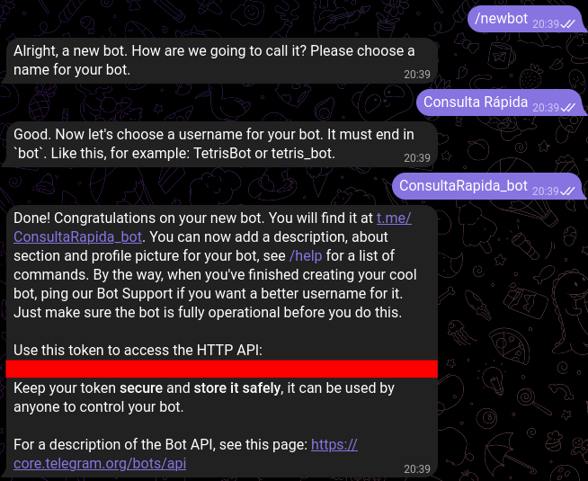
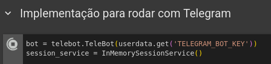

  
  <h1>Consulta Rápida Bot</h1>

  Projeto de chatbot com Google Gemini desenvolvido para a Imersão IA 2025 da Alura + Google.

## Descrição do Projeto

Você já se encontrou naquela situação de sentir um incômodo ou uma dor leve e não sabia se era algo sério o suficiente para procurar um médico? Muitas vezes pensamos "ainda dá pra aguentar" e acabamos apenas postergando a decisão até a situação se agravar.

Bom, o objetivo principal deste bot para Telegram é auxiliar o usuário a tomar uma decisão mais informada sobre a necessidade de buscar atendimento médico. Através de uma conversa simples e interativa no Telegram, o bot fará perguntas relevantes sobre seus sintomas e sua condição atual. Ao final da interação, o usuário receberá uma orientação inicial sobre se é recomendado procurar um médico o mais breve possível ou se a situação pode ser monitorada antes de tomar uma decisão.

**Importante:** Este bot oferece uma triagem inicial e **não substitui, de forma alguma, uma consulta médica profissional**. A avaliação fornecida aqui é apenas uma orientação preliminar e não deve ser considerada um diagnóstico ou recomendação de tratamento. Em caso de dúvidas persistentes ou sintomas graves, procure sempre um médico.

## Funcionalidades Principais

- **Coleta de Sintomas:** O bot será capaz de interagir com o usuário para entender seus sintomas e queixas de saúde.
- **Avaliação de Urgência:** Com base nas informações fornecidas, o bot avaliará a urgência da situação.
- **Recomendação:** O bot fornecerá uma recomendação clara ao usuário, indicando se é aconselhável procurar um médico ou se pode aguardar.
- **Indicação:** Se o bot aconselhar a produra de um médico ele oferece para buscar clinicas próximas
- **Integração com Telegram:** O bot será especificamente desenvolvido para a plataforma Telegram, aproveitando seus recursos de interação.

## Agentes

- Pesquisador: pesquisa informações dos sintomas e possíveis causas no Google

retorna: possíveis causas, remediações e nível de urgência do problema (se é recomendado buscar atendimento médico ou se pode monitorar um pouco antes de tomar uma decisão)

- Mediador: simplifica a informação recebida para retornar ao usuário

retorna: informação resumida e em termos simples, pede por mais informações sobre o problema se necessário. Se a informação tiver boa base, identifica qual médico especialista e direciona o usuário para o médico especialista ou plantão.

- Localizador: busca no Google por médicos/consultórios ou prontos atendimentos próximos do usuário

retorna: médicos/consultórios ou prontos atendimentos juntamente com seus horários de atendimento

## Rodando o projeto

Para rodar o projeto é necessário criar um bot no Telegram usando o `@BotFather` e pegar a API Key do bot criado

- Use o comando `/newbot`, de um nome que o bot vai mostrar na conversa e depois um nome terminando com `_bot` que vai ser o nome que os usuários podem pesquisar.

- Acesse o  para abrir o projeto.

- No colab adicione as chaves de API do bot do Telegram `TELEGRAM_BOT_KEY` e do Gemini `GOOGLE_API_KEY` nos secrets

- Agora é só apertar `Ctrl + F9` no seu teclado para rodar todas as células do projeto no colab que assim que começar a rodar a última celula ja vai dar para conversar com o bot no telegram

Quando estiver rodando o bot fica assim:

